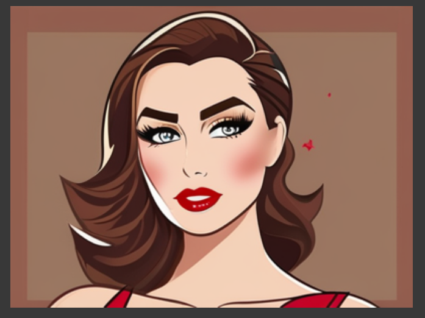
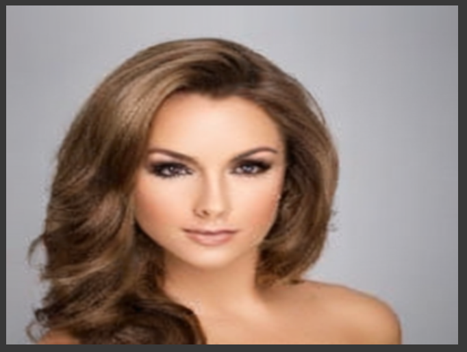

# Fine-tuning Stable Diffusion [SDXL - QLORA] on Custom Dataset for Image Generation

This repository contains code and resources for fine-tuning a Stable Diffusion model on a custom dataset to generate high-quality images.

## Project Overview

The project focuses on training and optimizing a Stable Diffusion model for specific image generation tasks using transfer learning techniques.

## Dataset

-  [CelebA Dataset](http://mmlab.ie.cuhk.edu.hk/projects/CelebA.html) for face images.

---
base_model: stabilityai/stable-diffusion-xl-base-1.0
library_name: diffusers
license: creativeml-openrail-m


<strong style="color: rosybrown; font-size: 18px">Text-to-Image Generation with Fine-Tuned SDXL [QLoRA]</strong>

<strong>Goal of this project:</strong> This project focuses on building an advanced text-to-image generation system using the Stable Diffusion XL (SDXL) model, a state-of-the-art deep learning architecture. The goal is to transform natural language text descriptions into visually coherent and high-quality images, unlocking creative possibilities in areas like art generation, design prototyping, and multimedia applications.

To enhance performance and tailor the model to specific use cases, SDXL is fine-tuned using <strong>QLoRA (Quantized Low-Rank Adaptation)</strong>. This approach leverages efficient parameter fine-tuning and memory optimization techniques, enabling high-quality adaptations with reduced computational overhead. Fine-tuning with QLoRA ensures that the model is optimized for domain-specific text-to-image tasks, delivering even more precise and creative outputs.

### Simplified Architecture:


<strong style="text-decoration: underline">Example Prompts: </strong>
<p style="color: orangered">1. A young, attractive female with arched eyebrows and a pointy nose. She has wavy brown hair, wears heavy makeup with lipstick, and exudes a confident, stylish look. The scene features soft, flattering lighting that enhances her youthful features and glamorous appearance.</p>
<p style="color: orangered">2. A male with an oval face, big nose, high cheekbones, and a receding hairline. He has black hair, bushy eyebrows, and his mouth is slightly open in a smile. The subject is clean-shaven, with no beard.</p>
<p style="color: orangered">3. Male with a big nose, black hair, bushy eyebrows, high cheekbones, and a receding hairline. He has an oval face, a mouth slightly open in a smile, and is clean-shaven with no beard.</p>


<p style="font-family:Lucida Sans ;font-size:15px;">Dataset Description: CelebFaces Attributes Dataset (CelebA).</p>

<p style="font-family: Lucida Sans ;font-size:15px;">The CelebA dataset is a widely-used, large-scale dataset in the field of computer vision, particularly for tasks related to faces. It consists of over 200,000 celebrity face images annotated with a rich set of attributes. The dataset offers diverse visual content with variations in pose, facial expressions, and backgrounds, making it suitable for a range of face-related applications.</p>


<strong>Here are few examples of generated images Using Stable Diffusion SDXL:</strong>

<strong>Before Fine-Tuning SDXL</strong>


<strong>After Fine-Tuning SDXL on Custom Dataset</strong>



#### How to use

## Loading Pre-trained Model and Fine-Tuned LoRA Weights

This section demonstrates how to load the pre-trained Stable Diffusion XL model and the fine-tuned LoRA weights for generating high-quality images based on text prompts.

### Prerequisites
Ensure you have the necessary dependencies installed. You can install them via:
import torch
from diffusers import DiffusionPipeline

# Path to the directory containing fine-tuned LoRA weights
model_path = "Shuhaib73/stablediffusion_fld"

# Load the pre-trained Stable Diffusion XL model

```python
>>> trained_pipe = DiffusionPipeline.from_pretrained(
    "stabilityai/stable-diffusion-xl-base-1.0", 
    torch_dtype=torch.float16
)
```

# Move the pipeline to GPU for faster processing
```python
trained_pipe.to("cuda")
```

# Load the fine-tuned LoRA weights into the pipeline
```python
trained_pipe.load_lora_weights(model_path)
```


