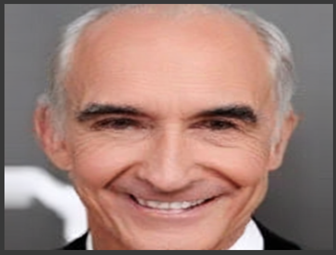

# Fine-tuning Stable Diffusion [SDXL - QLORA] on Custom Dataset for Image Generation  🖋️ 🚀 🖼️


## <br>**➲ Project Overview** :

❇️ The project focuses on training and optimizing a Stable Diffusion model for specific image generation tasks using transfer learning techniques.

## <br>**➲ Dataset** :

-  [CelebA Dataset](http://mmlab.ie.cuhk.edu.hk/projects/CelebA.html) for face images.

---
--  base_model: stabilityai/stable-diffusion-xl-base-1.0
--  library_name: diffusers

### *** Note: To access the Web Application Kindly visit my portfolio website or you can contact me through LinkedIn/Mail.***

<strong> 🎯 Goal of this project:</strong> This project focuses on building an advanced text-to-image generation system using the Stable Diffusion XL (SDXL) model, a state-of-the-art deep learning architecture. The goal is to transform natural language text descriptions into visually coherent and high-quality images, unlocking creative possibilities in areas like art generation, design prototyping, and multimedia applications.

 ❇️ To enhance performance and tailor the model to specific use cases, SDXL is fine-tuned using <strong>QLoRA (Quantized Low-Rank Adaptation)</strong>. This approach leverages efficient parameter fine-tuning and memory optimization techniques, enabling high-quality adaptations with reduced computational overhead. Fine-tuning with QLoRA ensures that the model is optimized for domain-specific text-to-image tasks, delivering even more precise and creative outputs.

## <br>**➲ Simplified Architecture** :


## <br>**➲ Model Workflow Pipeline** :


## <br>**➲ Dataset Description: CelebFaces Attributes Dataset (CelebA)** :

<p style="font-family: Lucida Sans ;font-size:15px;">The CelebA dataset is a widely-used, large-scale dataset in the field of computer vision, particularly for tasks related to faces. It consists of over 200,000 celebrity face images annotated with a rich set of attributes. The dataset offers diverse visual content with variations in pose, facial expressions, and backgrounds, making it suitable for a range of face-related applications.</p>


## <br>**➲ 🌟 Here are few examples of generated images Using Stable Diffusion SDXL:

<strong>Before Fine-Tuning SDXL</strong><br>

<br><br>
<strong>After Fine-Tuning SDXL on Custom Dataset</strong><br><br>



## 🛠️ **Technologies Used**

- **Python** 🐍: The core programming language that powers the app.  
- **Flask**: A Backend web framework for building web applications.  
- **Stable Diffusion XL (SDXL)**: A powerful deep learning model used for generating high-quality images from textual descriptions, integrated in this project for text-to-image generation.
- **QLORA**: A method for optimizing the performance of Stable Diffusion XL, enabling more efficient training and fine-tuning on custom datasets.
- **Diffusers**: A library built on top of PyTorch that provides pre-trained models for generating images from text, utilized in this project to implement Stable Diffusion XL.
- **TensorFlow**: Leveraged in this project as the primary framework for building and deploying the deep learning model for sentiment classification.
- **Keras**: A high-level neural networks API, Used in combination with TensorFlow to simplify the construction and training of deep learning models, enabling efficient sentiment prediction.
- **PyTorch**: A deep learning framework, employed for building and training the model on custom datasets, and used for inference in the image generation pipeline.
- **OpenCV**: A computer vision library used for processing and manipulating images, such as resizing, transforming, and post-processing the generated images to improve quality.
- **Docker**: Utilized in this project to create a containerized environment for the app, ensuring consistent development and deployment across different environments.
- **Docker Container Images**: Employed to package all necessary code, libraries, and dependencies, allowing for the easy deployment and scaling of the sentiment analysis app.
- **CI/CD (Continuous Integration/Continuous Deployment)**: Integrated into the development workflow to automatically test and deploy new changes to the app, ensuring higher quality and faster release cycles for updates.
- **GitHub Actions**: Implemented for automating the CI/CD pipeline, allowing for seamless building, testing, and deployment of the sentiment analysis model directly from GitHub.
- **Pandas**: A robust library for dataset management and processing.  
- **Matplotlib/Seaborn**: Used for creating impactful visualizations that simplify data insights.  

These technologies collectively make the Sentiment Analyzer app a versatile, efficient, and easy-to-use tool for professionals and researchers alike! 🚀

## 🌟 **Usage Examples**

1. **Targeted Advertising:** Generate personalized faces for advertisements tailored to specific demographics. For example, "A young woman with curly hair wearing trendy sunglasses" for promoting fashion accessories.

2. **Virtual Influencers:** Create realistic celebrity-like virtual personalities for brands to engage audiences on social media platforms, such as "A smiling man with a neat beard and stylish glasses."

3. **Facial Attribute Illustration:** Generating images of faces based on text descriptions of specific attributes (e.g., "A smiling woman with blond hair and glasses").

4. **Personalized Avatar Creation:** Create custom avatars by specifying attributes such as "A young man with a mustache and curly hair."

5. **E-commerce and Product Visualization:** Display how accessories like glasses, hats, or earrings look on different faces. For example, "A man with a square jawline wearing a fedora."

6. **Entertainment Marketing:** Design promotional materials by generating faces of fictional characters for movies, games, or TV shows. For instance, "A mysterious man with a scar across his cheek and intense eyes."

7. **Event Promotions:** Create promotional imagery with realistic faces for events like fashion shows or conferences. Example: "A group of diverse people smiling at a conference."

8. **Education and Training:** Generate faces for use in training materials, such as "A teacher-like figure with glasses and a welcoming smile."


<p align="center">
  
</p>


## <br>**➲ ✨  How to use the fine-tuned model for image generation ✨ **:  

### <br>**➲ Loading Pre-trained Model and Fine-Tuned LoRA Weights** :

This section demonstrates how to load the pre-trained Stable Diffusion XL model and the fine-tuned LoRA weights for generating high-quality images based on text prompts.

### Prerequisites
Ensure you have the necessary dependencies installed. You can install them via:
import torch
from diffusers import DiffusionPipeline

### <br>**➲ Path to the directory containing fine-tuned LoRA weights** :
    -- model_path = "Shuhaib73/stablediffusion_fld"

### Load the pre-trained Stable Diffusion XL model

```python
>> import torch
from diffusers import DiffusionPipeline
```

```python
>>> model_path = "Shuhaib73/stablediffusion_fld"
```

```python
>>> trained_pipe = DiffusionPipeline.from_pretrained("stabilityai/stable-diffusion-xl-base-1.0", torch_dtype=torch.float16)
```

### Move the pipeline to GPU for faster processing
```python
>>> trained_pipe.to("cuda")
```

## Load the fine-tuned LoRA weights into the pipeline
```python
>>> trained_pipe.load_lora_weights(model_path)
```

### Generate an image 
```python
>>> generated_images = trained_pipe(
    prompt = "A young woman with long, straight hair, wearing elegant earrings. Her calm expression and stylish outfit complement her natural beauty, with a softly blurred background adding a touch of depth."
)
```


## <br>**➲ Dockerizing and Building a Website using Flask:
    --- To make the model accessible to a wider audience, the system is containerized using Docker, which simplifies deployment and ensures that the application runs consistently across different environments. Docker will package the model, its dependencies, and the web server into a container, allowing for easy scalability and deployment.
    --- Additionally, a Flask-based web application is developed to provide a user-friendly interface for interacting with the model. The website will allow users to input text descriptions and receive generated images in real-time. Flask will handle the routing, user interaction, and model inference, while Docker ensures the system is deployed seamlessly, enabling easy access through a web browser.

---


## 📧 **Contact**

For questions, feedback, or contributions, please contact:  
**Shuhaib**  
**Email**: mohamed.shuhaib73@gmail.com
**LinkedIn**: https://www.linkedin.com/in/mohamedshuhaib/

---
    
